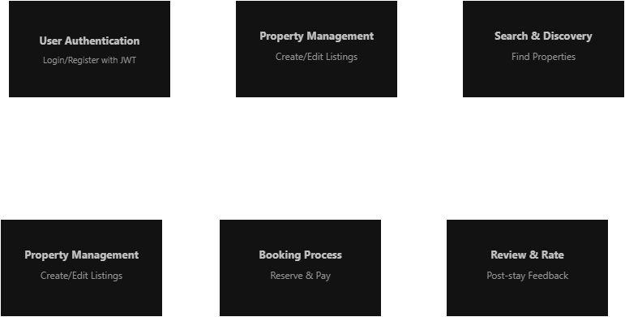

# Airbnb Clone Backend

# 

## Features & Functionalities Documentation

---

## 🏠 Core Functionalities

### User Management

- Complete user lifecycle management
  - User Registration (Guest/Host)
  - JWT Authentication
  - OAuth Integration (Google, Facebook)
  - Profile Management
  - Photo & Contact Info Updates

### Property Listings Management

- Full CRUD operations for property listings
  - Create Listings (Title, Description, Location)
  - Price & Amenities Management
  - Availability Calendar
  - Edit/Delete Listings
  - Image Upload & Management

### Search & Filtering

- Advanced search capabilities
  - Location-based Search
  - Price Range Filtering
  - Guest Capacity Filter
  - Amenities Filter
  - Pagination Support

### Booking Management

- Complete booking lifecycle
  - Booking Creation & Date Validation
  - Double Booking Prevention
  - Booking Cancellation
  - Status Tracking (Pending/Confirmed/Canceled)
  - Cancellation Policy Enforcement

---

## ⚙️ Technical Requirements

### Database Management

- Relational database architecture
  - PostgreSQL/MySQL Implementation
  - Users Table (Guests & Hosts)
  - Properties, Bookings, Reviews Tables
  - Payments Table
  - Optimized Query Performance

### API Development

- RESTful API implementation
  - HTTP Methods (GET, POST, PUT, DELETE)
  - Proper Status Codes
  - GraphQL Support (Optional)
  - API Documentation
  - Error Handling & Logging

### Authentication & Authorization

- Secure access control
  - JWT Implementation
  - Role-Based Access Control (RBAC)
  - Guest/Host/Admin Permissions
  - Session Management
  - Password Encryption

### File Storage & Third-Party Services

- External integrations
  - Cloud Storage (AWS S3/Cloudinary)
  - Email Services (SendGrid/Mailgun)
  - Payment Gateways (Stripe/PayPal)
  - Multi-currency Support
  - Automated Payouts

---

## ⭐ Additional Core Features

### Payment Integration

- Secure payment processing
  - Stripe/PayPal Integration
  - Upfront Guest Payments
  - Automatic Host Payouts
  - Multi-currency Support
  - Transaction History

### Reviews & Ratings

- Review system management
  - Guest Property Reviews
  - Host Review Responses
  - Booking-linked Reviews
  - Rating Aggregation
  - Review Abuse Prevention

### Notifications System

- Multi-channel communication
  - Email Notifications
  - In-app Notifications
  - Booking Confirmations
  - Cancellation Alerts
  - Payment Updates

### Admin Dashboard

- Administrative control panel
  - User Management
  - Listing Oversight
  - Booking Monitoring
  - Payment Tracking
  - System Analytics

---

## 🛡️ Non-Functional Requirements

### Scalability

- System growth capabilities
  - Modular Architecture
  - Horizontal Scaling
  - Load Balancing
  - Traffic Management

### Security

- Data protection & system security
  - Data Encryption
  - Password Security
  - Firewall Implementation
  - Rate Limiting
  - Payment Information Security

### Performance Optimization

- Speed & efficiency improvements
  - Redis Caching
  - Search Result Caching
  - Database Query Optimization
  - Response Time Improvement

### Testing

- Quality assurance framework
  - Unit Testing (pytest)
  - Integration Testing
  - API Testing Automation
  - Endpoint Validation
