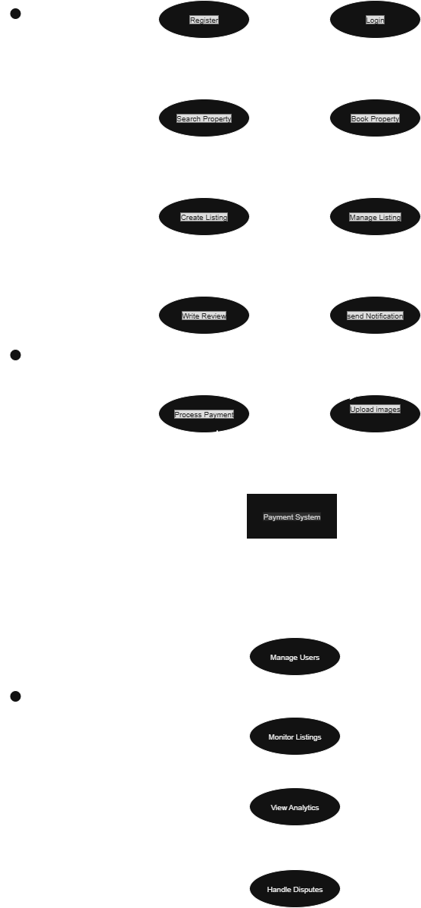

# Airbnb Clone Use Case Diagram

---

## Overview

This diagram illustrates the main actors, external systems, and core functionalities of the Airbnb Clone backend using UML notation.

---

## Actors

- **Guest**: Users who search and book properties.
- **Host**: Users who create and manage property listings.
- **Admin**: System administrators who oversee platform operations.

## External System

- **Payment System**: Handles all payment processing for bookings and payouts.

---

## Core Use Cases

Organized in four functional groups:

### 1. Authentication

- Register
- Login
- Manage Profile

### 2. Core Functions

- Search Property
- Book Property
- Process Payment

### 3. Property Management

- Create Listing
- Manage Listing
- Upload Images

### 4. Additional Features

- Write Review
- Send Notification
- View Analytics

---

## Associations & System Boundary

- Actors are connected to their respective use cases with straight association lines, showing who can perform which actions.
- All use cases are contained within a clearly labeled system boundary: **Airbnb Clone System**.
- The Payment System is shown as an external rectangle, connected to relevant use cases.

---

## Notes

This diagram focuses on the essential functionalities and relationships, maintaining clarity and proper UML standards with stick figure actors, elliptical use cases, and clean associations.
